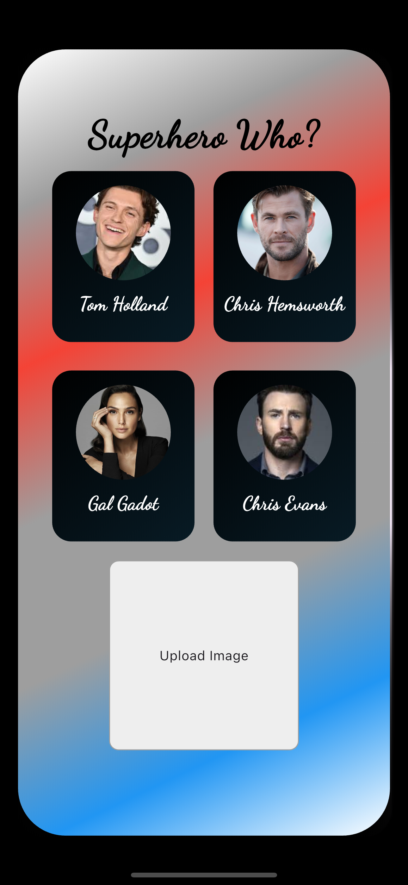
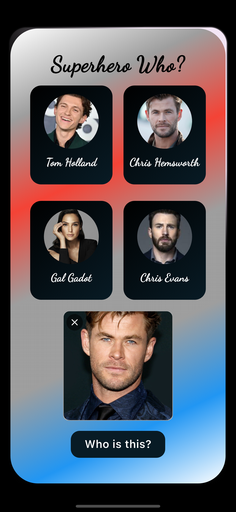
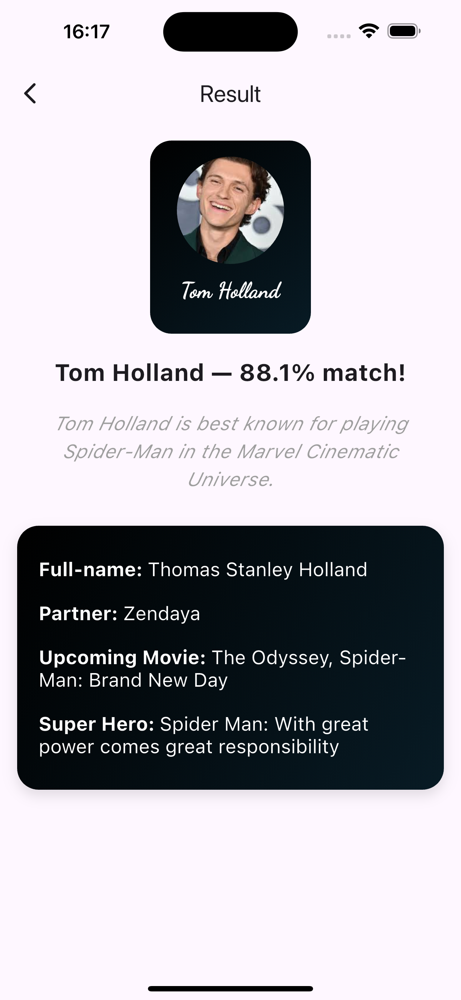

<p align="center"> <h1 align="center">🦸‍♂️ Superhero Image Classifier</h1> </p> <p align="center"> <a href="#"></a> <a href="#"></a> <a href="#"></a> <a href="#"></a> </p>


This project is an Image Classification App that classifies images into four superhero classes based on the uploaded picture

## 🧠 Technologies Used

| Tech | Purpose |
| :--- | :------ |
| **Python** | Core backend, Machine Learning logic |
| **Flask** | API server for receiving images and returning predictions |
| **OpenCV** | Face and eye detection (Computer Vision) |
| **Scikit-learn** | Training and loading the Machine Learning model |
| **PyWavelets** | Feature extraction using Wavelet transforms |
| **Flutter** | Beautiful frontend app |

## 🎥 Home Page


## 🎥 Upload Image


## 🎥 Super Hero Info


## 🎥 Demo


### Screen recording on Iphone 15 pro max simulator


## 🛠️ How It Works (Behind the Scenes)

1. You upload a photo through the Flutter app.
2. Flutter sends it to the Python Flask server.
3. Flask:
   - Detects the face and eyes using **OpenCV** (Computer Vision 🤖).
   - Preprocesses the uploaded image (cropping, resizing, applying Wavelet Transforms).
   - Feeds it into a trained **Machine Learning model** (built with Scikit-learn).
4. The server predicts which superhero the image most resembles and sends the result back.


## 🖥️ Backend Structure (Python + Flask)

- `server.py`:  
  👉 Flask server with `/classify_image` endpoint to accept images and return predictions.

- `util.py`:  
  👉 Handles:
    - Loading the ML model and class mappings
    - Image preprocessing (cropping faces, resizing, applying wavelet transforms)
    - Running predictions with the loaded model

- `wavelet.py`:  
  👉 A helper for applying Wavelet Transformations to images.


---

## ⚡ Quick Start

### 1. Run the Backend (Python + Flask)

```bash
#clone repository

# Create a virtual environment
python -m venv venv
source venv/bin/activate  # Windows: venv\Scripts\activate

# Install the dependencies
pip install -r requirements.txt

# Start the Flask server
python server/server.py
```
✅ Server will run at: `http://localhost:5000`

---

### 2. Run the Frontend (Flutter)

```bash
# Navigate to directory

# Install Flutter dependencies
flutter pub get

# Run the app
flutter run
```


 Contributing

Feel free to fork this repository, submit issues, and make pull requests to improve the app!


